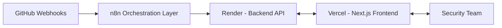

# 🚀 OBSIDIAN — Comprehensive Deployment Guide

This guide provides step-by-step instructions for deploying the complete OBSIDIAN platform. 
OBSIDIAN requires a multi-level orchestration setup involving our **Backend API**, **Frontend Dashboard**, and **n8n Workflow Automation**.

For cost-effective production, we deploy using:
1. **Frontend:** [Vercel](https://vercel.com) (Free, Serverless Edge)
2. **Backend:** [Render](https://render.com) (Free Web Service Tier, SQLite fallback)
3. **Orchestration:** Local Docker or Cloud n8n for webhook management

---

## 🏗️ Deployment Architecture

> [!NOTE]
> Ensure you have an **NVIDIA NIM API Key** and a **GitHub OAuth App** ready before you begin.

---

## 🔑 1. Prerequisites: GitHub OAuth App

Before deploying, you must create a GitHub OAuth application for user authentication and webhook integration.

1. Navigate to **GitHub Settings** ➔ **Developer Settings** ➔ **OAuth Apps** ➔ **New OAuth App**.
2. **Application name:** `OBSIDIAN Security`
3. **Homepage URL:** Your planned Vercel frontend URL (e.g., `https://obsidian-rwnd.vercel.app`)
4. **Authorization callback URL:** Your Vercel frontend URL + `/api/auth/callback/github`
5. Generate a new **Client Secret** and copy it safely.
6. Save the **Client ID** and **Client Secret**.

---

## ⚙️ 2. Backend Deployment (Render)

We utilize Render's "Blueprint" feature to automatically provision the backend API and queue workers based on the `render.yaml` file included in the repository.

### Steps:
1. Log in to the [Render Dashboard](https://dashboard.render.com/).
2. Click the **New +** button (top right) and select **Blueprint**.
3. Connect your GitHub repository (`MDWASIULLAH/obsidian`).
4. Render will parse the `render.yaml` and prepare the `obsidian-backend` web service.
5. You will be prompted to enter Environment Variables. Configure them as follows:

| Environment Variable | Description | Example Value |
|----------------------|-------------|---------------|
| `NVIDIA_API_KEY` | Key for LLM inference | `nvapi-...` |
| `GITHUB_TOKEN` | (Optional) PAT for API limits | `ghp_...` |
| `GITHUB_ID` | OAuth Client ID | `Iv1.8...` |
| `GITHUB_SECRET` | OAuth Client Secret | `9a7b...` |
| `NEXTAUTH_URL` | Exact Frontend URL | `https://obsidian-rwnd.vercel.app` |
| `FRONTEND_URL` | Frontend URL (No trailing slash) | `https://obsidian-rwnd.vercel.app` |

6. Click **Apply / Save**.
7. Wait ~3-5 minutes. Once the green **Live** badge appears, copy the service URL (e.g., `https://obsidian-backend-gute.onrender.com`).

> [!IMPORTANT]
> Keep the backend URL handy. You will need it to configure the Frontend and n8n layers.

---

## 🖥️ 3. Frontend Deployment (Vercel)

The 13-page dashboard is built with Next.js 15 and is located in the `/frontend` directory.

### Steps:
1. Log in to the [Vercel Dashboard](https://vercel.com/dashboard).
2. Click **Add New...** ➔ **Project**.
3. Import your GitHub repository (`MDWASIULLAH/obsidian`).
4. **CRITICAL STEP:** In the "Configure Project" screen, locate **Root Directory**. Click **Edit** and set it to `frontend`. This instructs Vercel where the Next.js application lives.
5. Open the **Environment Variables** section and add:

| Environment Variable | Description | Example Value |
|----------------------|-------------|---------------|
| `NEXT_PUBLIC_API_URL`| The Render URL from Step 2 | `https://obsidian-backend-gute.onrender.com` |
| `NEXTAUTH_URL` | Your Vercel frontend URL | `https://obsidian-rwnd.vercel.app/` |
| `NEXTAUTH_SECRET` | 32-character random string | `(Generate via openssl rand -base64 32)` |
| `GITHUB_ID` | OAuth Client ID | `Iv1.8...` |
| `GITHUB_SECRET` | OAuth Client Secret | `9a7b...` |

6. Click **Deploy** and wait 1-2 minutes for the build to complete.

---

## 🔄 4. Multi-Level Orchestration Deployment (n8n)

OBSIDIAN uses **n8n** to handle the high-level orchestration of GitHub webhooks, routing them to the internal Event Sourcing Normalizer and the OBSIDIAN Agent Node, and dispatching alerts to Slack/Discord.

### Steps:
1. Deploy n8n (either via [n8n Cloud](https://n8n.io/cloud) or self-hosted via Docker).
2. Import the `obsidian_n8n_workflow.json` (located in the repo root or provided separately) into your n8n workspace.
3. Configure the **GitHub Webhook Receiver** node with your repository details and webhook secret.
4. Configure the **OBSIDIAN Autonomous Agent Node** to point to your deployed Render Backend URL.
5. Set up the **Security Alert Dispatcher** node with your Slack/Discord webhook URL.
6. Activate the workflow.

> [!TIP]  
> By using n8n at the edge, OBSIDIAN intelligently filters and normalizes GitHub events before they hit the core backend API, significantly reducing unnecessary load and enabling rapid alert dispatches.

---

## ✅ 5. Final Verification & Troubleshooting

### Verification Flow:
1. Open your Vercel URL in your browser.
2. Click **Login with GitHub** and authorize the application.
3. You will be redirected to the `/dashboard/setup` page.
4. Push a dummy commit to your registered GitHub repository.
5. Verify in **n8n** that the webhook was received and routed to the Agent Node.
6. Check your OBSIDIAN Dashboard to see the scan progress and Digital Twin update.

### Common Issues:
- **GitHub Login gets stuck / 500 error:** Check the Render logs. Ensure the backend deployed successfully and is "Live".
- **Vercel Build Error "No Next.js version detected":** You forgot to set the **Root Directory** to `frontend` in your Vercel project settings.
- **CORS Errors in browser console:** Ensure `FRONTEND_URL` in Render matches your exact Vercel URL (without the trailing slash `/`).
- **Webhook Not Triggering Scan:** Verify that your n8n workflow is **Active** and that the HTTP Request node points to the correct Render Backend URL.
