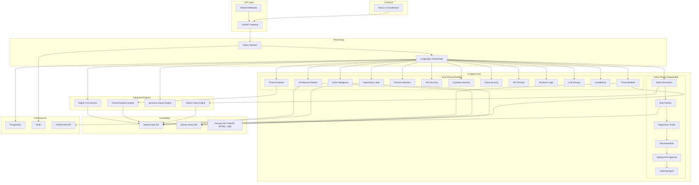

<div align="center">

# 🛡️ SENTINEL AI X

### Autonomous AI Security Engineering Organization

*An autonomous multi-agent AI platform for the Secure Software Development Lifecycle*

[](https://python.org)
[](https://fastapi.tiangolo.com)
[](https://nextjs.org)
[](https://langchain.com)
[](https://build.nvidia.com)

</div>

---

## 🎯 What is SENTINEL AI X?

**SENTINEL AI X** is not a chatbot, not a code review tool, and not a GitHub Copilot clone.

It is an **entire autonomous Security Engineering Organization** where **19 specialized AI agents** collaborate to analyze, secure, repair, test, document, and approve software before deployment — all triggered by a single `git push`.

```
┌──────────────────────────────────────────────────────────────────────────┐
│                       SENTINEL AI X PIPELINE                            │
│                                                                          │
│  git push → Webhook → Event Sourcing → Digital Twin Update →             │
│  Knowledge Graph → 13 Parallel Scan Agents (incl. Threat Evolution) →    │
│  Attack Chain Discovery → Attack Simulation → Auto-Patch → Test Gen →   │
│  Business Impact Analysis → Deployment Approval (GO/NO-GO) → Learn      │
│                                                                          │
└──────────────────────────────────────────────────────────────────────────┘
```

## 🏗️ Architecture



## 🤖 The 19 Agents

| # | Agent | Tier | Phase | Purpose |
|---|-------|------|-------|---------|
| 1 | **Threat Modeler** | Reasoning | Scan | STRIDE/DREAD analysis, attack trees, MITRE ATT&CK mapping |
| 2 | **Architecture Reviewer** | Reasoning | Scan | Trust boundaries, design flaws, security anti-patterns |
| 3 | **Code Intelligence** | Code | Scan | Deep SAST — injection, XSS, auth bypass, data flow |
| 4 | **Dependency Intel** | Lightweight | Scan | CVE scanning, license compliance, supply chain risk |
| 5 | **Secrets Detection** | Lightweight | Scan | API keys, credentials, tokens, private keys |
| 6 | **Infra Security** | Code | Scan | Terraform, Ansible, K8s misconfigurations |
| 7 | **Container Security** | Code | Scan | Dockerfile analysis, image hardening |
| 8 | **Cloud Security** | Code | Scan | AWS/GCP/Azure misconfiguration detection |
| 9 | **API Security** | Code | Scan | OWASP API Top 10, rate limiting, auth gaps |
| 10 | **Business Logic** | Reasoning | Scan | Race conditions, auth bypass, logic flaws |
| 11 | **LLM Security** | Reasoning | Scan | Prompt injection, RAG poisoning, agent jailbreak |
| 12 | **Compliance** | Lightweight | Scan | GDPR, SOC2, HIPAA, PCI-DSS gap analysis |
| 13 | **Threat Evolution** | Reasoning | Scan | Predict threat mutation, weaponisation probability, kill-chain progression |
| 14 | **Attack Simulation** | Reasoning | Action | Chain vulnerabilities into attack paths |
| 15 | **Auto Patcher** | Code | Action | Generate production-quality security patches |
| 16 | **Regression Tester** | Code | Action | Generate tests that verify patches |
| 17 | **Documentation** | Code | Action | Update SECURITY.md, CHANGELOG |
| 18 | **Deployment Approval** | Reasoning | Action | GO/NO-GO decision with confidence scoring |
| 19 | **Learning Agent** | Reasoning | Action | Learn patterns to improve future runs |

## 🧠 Key Technologies

| Component | Technology | Purpose |
|-----------|-----------|---------|
| **LLM Backend** | NVIDIA NIM (Build API) | Multi-tier model routing (reasoning/code/lightweight) |
| **Agent Orchestration** | LangGraph | State machine pipeline with conditional event routing |
| **Knowledge Graph** | Neo4j | Attack path discovery, digital twin, threat evolution |
| **RAG Pipeline** | Qdrant | Semantic search over OWASP, MITRE, CWE knowledge bases |
| **API** | FastAPI | Async REST API with webhook + WebSocket support |
| **Task Queue** | Celery + Redis | Async event processing and pipeline execution |
| **Database** | PostgreSQL | Scan results, findings, patches, event sourcing |
| **Frontend** | Next.js 15 + React 19 | 11-page cybersecurity dashboard with Cytoscape.js |
| **Graph Viz** | Cytoscape.js | Interactive Digital Twin graph rendering |
| **Real-time** | WebSocket | Live graph mutation broadcasts |

## 🔮 Advanced Engines

| Engine | Purpose |
|--------|---------|
| **AI Security Digital Twin** | Live Neo4j mirror of repository state updated on every GitHub event (22 event types). Visualised with Cytoscape.js. |
| **Threat Evolution Engine** | Tracks how threats mutate over time with temporal snapshots. Predicts 30/60/90-day weaponisation probability via NVIDIA NIM. |
| **Attack Chain Movie** | Discovers multi-step attack paths via graph traversal and replays them cinematically with MITRE kill-chain progression. |
| **Business Impact Engine** | Dollar-value risk quantification using IBM breach cost methodology, regulatory fines (GDPR/HIPAA/PCI-DSS/SOC2/SOX/CCPA), and downtime-by-industry estimates. |
| **Security Timeline Engine** | Historical point-in-time snapshots of full repository security posture allowing structural diffing, replay, and posture trend analysis. |

## 🚀 Quick Start

### Prerequisites
- Docker & Docker Compose
- GitHub Personal Access Token
- NVIDIA NIM API Key ([build.nvidia.com](https://build.nvidia.com))

### 1. Clone & Configure

```bash
git clone https://github.com/your-org/sentinel-ai-x.git
cd sentinel-ai-x
cp .env.example .env
# Edit .env with your API keys
```

### 2. Start All Services

```bash
docker compose up -d
```

### 3. Access

| Service | URL |
|---------|-----|
| **Dashboard** | http://localhost:3000 |
| **API Docs** | http://localhost:8000/docs |
| **API Health** | http://localhost:8000/health |
| **Neo4j Browser** | http://localhost:7474 |
| **Qdrant UI** | http://localhost:6333/dashboard |

### 4. Register a Repository

```bash
curl -X POST http://localhost:8000/api/v1/repositories \
  -H "Content-Type: application/json" \
  -d '{"full_name": "owner/repo-name"}'
```

### 5. Trigger a Manual Scan

```bash
curl -X POST http://localhost:8000/api/v1/scans \
  -H "Content-Type: application/json" \
  -d '{"repository_id": "<repo-id>"}'
```

## 📁 Project Structure

```
sentinel-ai-x/
├── backend/
│   ├── app/
│   │   ├── agents/                  # All 19 AI agents + orchestrator
│   │   │   ├── base.py              # BaseAgent abstract class
│   │   │   ├── state.py             # LangGraph pipeline state (event-aware)
│   │   │   ├── orchestrator.py      # LangGraph state machine + event routing
│   │   │   ├── registry.py          # Agent factory & registry
│   │   │   ├── threat_modeler.py
│   │   │   ├── code_intelligence.py
│   │   │   ├── threat_evolution_agent.py  # Threat trajectory prediction
│   │   │   ├── security_agents.py   # 10 scan agents
│   │   │   └── action_agents.py     # 6 action agents
│   │   ├── api/
│   │   │   ├── router.py            # REST API (30+ endpoints)
│   │   │   └── websocket.py         # Digital Twin WebSocket manager
│   │   ├── core/
│   │   │   ├── config.py            # Settings (incl. GitHub App JWT)
│   │   │   ├── model_router.py      # NVIDIA NIM multi-tier routing
│   │   │   └── prompts.py           # 19 agent system prompts
│   │   ├── integrations/
│   │   │   └── github_client.py     # GitHub API + GraphQL + 22-event parser
│   │   ├── knowledge/
│   │   │   ├── graph.py             # Neo4j knowledge graph (20+ node types)
│   │   │   ├── digital_twin.py      # AI Security Digital Twin service
│   │   │   ├── threat_evolution.py  # Temporal threat tracking engine
│   │   │   ├── attack_chain.py      # Attack path discovery + movie gen
│   │   │   ├── business_impact.py   # Dollar-value risk quantification
│   │   │   ├── rag.py               # Qdrant RAG pipeline
│   │   │   └── security_kb.py       # OWASP/MITRE/CWE data
│   │   ├── models/
│   │   │   ├── github_event.py      # Event sourcing model
│   │   │   ├── schemas.py           # 40+ Pydantic schemas
│   │   │   └── ...                  # SQLAlchemy models
│   │   ├── tasks/
│   │   │   └── celery_app.py        # Async event + pipeline tasks
│   │   └── main.py                  # FastAPI application factory
│   ├── Dockerfile
│   └── requirements.txt
├── frontend/
│   ├── src/
│   │   ├── app/
│   │   │   ├── dashboard/           # 11 dashboard pages
│   │   │   │   ├── page.tsx              # Overview with gauge
│   │   │   │   ├── repositories/        # Repo management
│   │   │   │   ├── scans/              # Scan history
│   │   │   │   ├── threats/            # Finding explorer
│   │   │   │   ├── agents/             # Agent grid
│   │   │   │   ├── graph/              # Knowledge graph viz
│   │   │   │   ├── digital-twin/       # Cytoscape.js graph + WebSocket
│   │   │   │   ├── threat-evolution/   # Temporal timeline + predictions
│   │   │   │   ├── attack-chain/       # Cinematic attack replay
│   │   │   │   ├── business-impact/    # Dollar-value risk dashboard
│   │   │   │   └── reports/            # Security reports
│   │   │   ├── layout.tsx
│   │   │   └── globals.css
│   │   └── lib/
│   │       ├── api.ts            # Typed API client (30+ methods)
│   │       └── utils.ts          # Utility functions
│   ├── Dockerfile
│   └── package.json
├── docker-compose.yml
├── Makefile
├── .env.example
└── README.md
```

## 🌐 API Endpoints Reference

All endpoints are prefixed with `/api/v1`.

### Core

| Method | Endpoint | Description |
|--------|----------|-------------|
| `GET` | `/health` | Health check with service status |
| `GET` | `/dashboard/overview` | Aggregate stats (repos, scans, findings, agents) |

### Repositories

| Method | Endpoint | Description |
|--------|----------|-------------|
| `POST` | `/repositories` | Register a GitHub repository for monitoring |
| `GET` | `/repositories` | List all registered repositories |
| `GET` | `/repositories/{id}` | Get repository details |
| `DELETE` | `/repositories/{id}` | Remove a repository |

### Scans & Findings

| Method | Endpoint | Description |
|--------|----------|-------------|
| `POST` | `/scans` | Trigger a manual security scan |
| `GET` | `/scans` | List scan history (paginated) |
| `GET` | `/scans/{id}` | Get scan details with agent runs |
| `GET` | `/scans/{id}/findings` | List findings for a scan |
| `GET` | `/findings/{id}` | Get finding details with patches |
| `GET` | `/agents` | List all available agents and their status |

### GitHub Events & Webhooks

| Method | Endpoint | Description |
|--------|----------|-------------|
| `POST` | `/webhooks/github` | Receive GitHub webhook events (HMAC-verified) |
| `GET` | `/events/{repo_id}` | List GitHub events for a repo (paginated, filterable) |

### Digital Twin

| Method | Endpoint | Description |
|--------|----------|-------------|
| `GET` | `/digital-twin/{repo}` | Get full twin graph (nodes + edges) |
| `GET` | `/digital-twin/{repo}/search` | Search twin nodes by label/type |
| `GET` | `/digital-twin/{repo}/node/{id}` | Get detailed node info |
| `WS` | `/ws/digital-twin/{repo_id}` | WebSocket for live graph mutation updates |

### Threat Evolution

| Method | Endpoint | Description |
|--------|----------|-------------|
| `GET` | `/threat-evolution/{repo}/timelines` | List all threat evolution timelines |
| `GET` | `/threat-evolution/{repo}/timeline/{id}` | Get full timeline with snapshots |
| `GET` | `/threat-evolution/prediction/{id}` | Get LLM-predicted trajectory |
| `GET` | `/threat-evolution/{repo}/exploitability` | Exploitability rankings (top N) |

### Attack Chains

| Method | Endpoint | Description |
|--------|----------|-------------|
| `GET` | `/attack-chains/{repo}/discover` | Discover chains via graph traversal |
| `GET` | `/attack-chains/{repo}/list` | List persisted attack chains |
| `POST` | `/attack-chains/movie` | Generate cinematic attack movie from chain |
| `GET` | `/attack-chains/{repo}/blast-radius/{node}` | Compute blast radius from a node |

### Business Impact

| Method | Endpoint | Description |
|--------|----------|-------------|
| `POST` | `/business-impact/{repo}` | Compute dollar-value risk assessment |

## 📺 Dashboard Pages (11)

| Page | Route | Description |
|------|-------|-------------|
| **Overview** | `/dashboard` | Security gauge, finding trends, recent scans |
| **Repositories** | `/dashboard/repositories` | Register, manage, and monitor GitHub repos |
| **Scans** | `/dashboard/scans` | Scan history with status, duration, finding counts |
| **Threats** | `/dashboard/threats` | Finding explorer with severity filters and patches |
| **Agents** | `/dashboard/agents` | Agent grid showing 19 agents with tier/phase/status |
| **Knowledge Graph** | `/dashboard/graph` | Interactive graph of security relationships |
| **Digital Twin** | `/dashboard/digital-twin` | Live Cytoscape.js graph with WebSocket updates |
| **Threat Evolution** | `/dashboard/threat-evolution` | Timeline of threat mutations with LLM predictions |
| **Security Timeline** | `/dashboard/security-timeline` | Snapshot history, structural diffing, and 30-day trend |
| **Attack Chain** | `/dashboard/attack-chain` | Cinematic attack path replay with kill-chain viz |
| **Business Impact** | `/dashboard/business-impact` | Dollar-value risk gauge with regulatory exposure |
| **Reports** | `/dashboard/reports` | Exportable security assessment reports |

## 🔗 Supported GitHub Events (22)

The event sourcing layer captures and processes the following webhook event types:

| Category | Events |
|----------|--------|
| **Code Changes** | `push`, `pull_request`, `pull_request_review`, `pull_request_review_comment` |
| **Issues & Discussions** | `issues`, `issue_comment` |
| **Security Alerts** | `security_advisory`, `dependabot_alert`, `secret_scanning_alert`, `code_scanning_alert` |
| **Repository Management** | `create`, `delete`, `fork`, `star`, `repository` |
| **Releases & Deployments** | `release`, `deployment`, `deployment_status` |
| **Collaboration** | `member`, `team_add`, `organization` |
| **CI/CD** | `workflow_run`, `check_suite` |

## 🗃️ Neo4j Node Types (20+)

The knowledge graph schema includes the following node types with uniqueness constraints and indexes:

| Node Type | Purpose |
|-----------|---------|
| `Repository` | Root node — linked to all artefacts |
| `File`, `Module`, `Class`, `Function` | Code structure graph |
| `Vulnerability`, `Threat` | Security findings |
| `Dependency` | Third-party packages and CVEs |
| `APIEndpoint`, `AuthFlow`, `TrustBoundary` | Architecture graph |
| `Secret`, `DatabaseConnection` | High-value assets |
| `Infrastructure`, `CloudResource`, `Container`, `DockerImage` | Deployment graph |
| `ExternalService`, `DataFlow` | Data movement and integrations |
| `TerraformResource`, `GitHubAction` | IaC and CI/CD nodes |
| `ThreatSnapshot`, `PredictedTrajectory` | Temporal threat evolution |
| `AttackChain` | Persisted multi-step attack paths |

## ⚙️ Environment Variables

| Variable | Required | Description |
|----------|----------|-------------|
| `NVIDIA_API_KEY` | ✅ | NVIDIA NIM Build API key |
| `DATABASE_URL` | ✅ | PostgreSQL connection string |
| `REDIS_URL` | ✅ | Redis connection string |
| `NEO4J_URI` | ✅ | Neo4j Bolt URI (e.g. `bolt://localhost:7687`) |
| `NEO4J_USER` | ✅ | Neo4j username |
| `NEO4J_PASSWORD` | ✅ | Neo4j password |
| `QDRANT_URL` | ✅ | Qdrant REST endpoint |
| `GITHUB_TOKEN` | ✅ | GitHub Personal Access Token or App token |
| `GITHUB_WEBHOOK_SECRET` | ✅ | HMAC secret for webhook verification |
| `GITHUB_APP_ID` | ⬜ | GitHub App ID (for App auth mode) |
| `GITHUB_PRIVATE_KEY` | ⬜ | GitHub App RSA private key (PEM) |
| `GITHUB_INSTALLATION_ID` | ⬜ | GitHub App Installation ID |
| `NEXT_PUBLIC_API_URL` | ⬜ | Frontend API base URL (default: `http://localhost:8000/api/v1`) |
| `NEXT_PUBLIC_WS_URL` | ⬜ | WebSocket base URL (default: auto-detected) |

## 🔐 Security Features

- **HMAC-SHA256 webhook verification** — Every GitHub event is cryptographically verified
- **GitHub App JWT authentication** — Secure installation-level access with RSA key signing
- **Event sourcing** — All 22 GitHub event types persisted with `payload_hash` for idempotency and time-travel
- **AI Security Digital Twin** — Live Neo4j graph mirror updated incrementally on every event via WebSocket
- **Threat Evolution tracking** — Temporal snapshots with velocity/trend metrics and 30/60/90-day weaponisation prediction
- **Attack Chain Movies** — Graph-traversal-based multi-step attack path discovery with cinematic replay
- **Business Impact quantification** — Dollar-value risk using IBM breach cost methodology + regulatory fines
- **Model tiering** — Sensitive code analyzed with reasoning-tier models, routine with lightweight
- **RAG citations** — Every finding includes source citations from OWASP/MITRE/CWE
- **Confidence scoring** — Every finding has a machine-learning confidence score
- **Auto-patching** — Production-ready patches with minimal, focused changes
- **Regression tests** — Automated test generation to verify patches
- **GO/NO-GO** — AI deployment approval with blocking for critical issues
- **Exploitability rankings** — Threats ranked by `severity × velocity × recency` for prioritised remediation

## 📄 License

MIT License — Built for the AI Agent Hackathon.

---

<div align="center">

**Built with ❤️ using NVIDIA NIM • LangGraph • FastAPI • Neo4j • Qdrant • Next.js**

</div>
